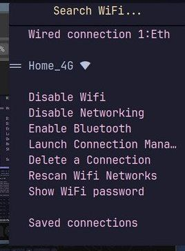
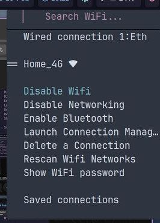
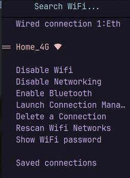
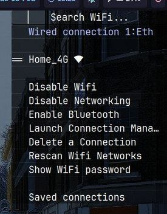

## About the project
A better way to do wifi menu

The project is primarily aimed at  people that are newbs to linux distros and want a generic solution for whatever window manager , or desktop environment they hope on, worrying about ui for wifi menu is annoying , also gtk, qt implementation look wierd and old to me , other options lack either proper pre configured ui or have a shady look or are non functional in their performance charts . This tries to act as your prefferred way by solving all the problems.

If you are looking for a plug and play utility to manage wifi and ethernet connections , network_manager_ui might be the choice for you

This project uses rofi as a ui library and python script as backend to create a seamless, beautiful, elegant and working network manager 

If you dont like system tray implementations such as nm_appllet , nm_ui is worth considering 

Other implementations such as network_manager_rofi is very slow and inefficent .

Also since the project uses rofi , using Search functionality saves you alot of mouse effort

## Demonstration


## Theming 
The menu comes in four diffrent flavours or themes which are references to great color palletes

1.Catppuccin Mocha <br>
  
<br><br><br>
2. Nord - Arctic vibes
<br>
  
<br><br><br>
3. Rospine - Sooho Vibes
<br>
  
<br><br><br>
4. Monochrome - Minimalism
   <br>
   
<br><br><br>

To change themes go to ~/.config/rofi/wifi/config.rasi and change theme name to whatever you like 

## Installation


Installation Guide-
Dependencies- rofi, or rofi-wayland if you are on wayland , NetworkManager , Python3 , pinentry-gtk(default) or pinentry-qt
Some form of notification system (ex if you are on a wlroots based compositor swaync) 

### For Arch linux
If you are on arch-based system 

```bash
sudo pacman -Syy rofi-wayland networkmanager python3 pinentry swaync --needed
```
### For Ubuntu/Debian
```bash
sudo apt update && sudo apt install network-manager python3 pinentry swaync
```
#### If you are on wayland , The rofi-wayland fork is not available on debian based systems from apt , build it from source instead <br> https://github.com/in0ni/rofi-wayland

#### If you using X11 based Window Manager , install rofi instead . 

``` bash 
sudo apt install rofi
```
### For nixOS 
Files have been included by the help of [j-baker](https://github.com/j-baker), this has not been included in the install script for nixOS, manual install is required


### For Fedora
```bash
sudo dnf install rofi-wayland NetworkManager python3 pinentry swaync
```

#### On Fedora if you have X11 based WM ,instead install rofi instead of rofi-wayland

### Install
```bash
git clone https://github.com/Blazzzeee/network_manager_ui.git
cd network_manager_ui
./install.sh
```
  


### Usage
Run the menu by calling network_manager as a keybind or from your panel such as waybar , polybar etc , without any system tray
, don't forget to restart terminal after installation :D
```bash
network_manager
```
For any issues contact me at @maanikhurana1007@gmail.com
